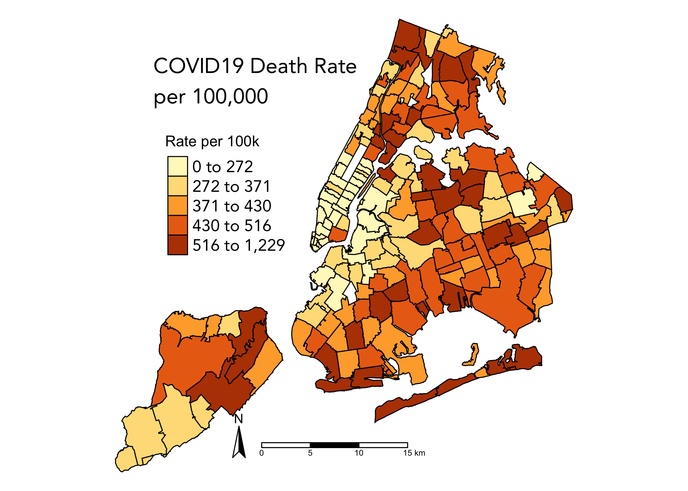

mapping_risk
================
Sarah Forrest
2022-11-15

This code creates a combined map of New York City’s death rates per
100,000 and excess risk of dying from dying from COVID-19 by modified
zip code tabulation area (modZCTA)

# Read In Data

Read in NYC MODZCTA shapefile:

``` r
zip_nyc <- st_read("data/mapping_risk/MODZCTA_2010.shp")
## Reading layer `MODZCTA_2010' from data source 
##   `/Users/sarahforrest/Documents/Graduate Courses/3_Fall 2022 Semester/Public Health GIS/R code/gis/data/mapping_risk/MODZCTA_2010.shp' 
##   using driver `ESRI Shapefile'
## Simple feature collection with 178 features and 2 fields
## Geometry type: MULTIPOLYGON
## Dimension:     XY
## Bounding box:  xmin: 913176 ymin: 120122 xmax: 1067382 ymax: 272844
## Projected CRS: Lambert_Conformal_Conic

str(zip_nyc)
## Classes 'sf' and 'data.frame':   178 obs. of  3 variables:
##  $ MODZCTA : chr  "10001" "10002" "10003" "10004" ...
##  $ label   : chr  "10001, 10118" "10002" "10003" "10004" ...
##  $ geometry:sfc_MULTIPOLYGON of length 178; first list element: List of 1
##   ..$ :List of 1
##   .. ..$ : num [1:84, 1:2] 987646 987522 987296 987334 986752 ...
##   ..- attr(*, "class")= chr [1:3] "XY" "MULTIPOLYGON" "sfg"
##  - attr(*, "sf_column")= chr "geometry"
##  - attr(*, "agr")= Factor w/ 3 levels "constant","aggregate",..: NA NA
##   ..- attr(*, "names")= chr [1:2] "MODZCTA" "label"

tm_shape(zip_nyc) +
  tm_polygons()
```

<!-- -->

Read-in data COVID-19 by NYC MODZCTA:

``` r
covid <- read_csv("data/mapping_risk/data-by-modzcta.csv")
str(covid)
## spec_tbl_df [177 × 6] (S3: spec_tbl_df/tbl_df/tbl/data.frame)
##  $ modified_ZCTA: num [1:177] 10001 10002 10003 10004 10005 ...
##  $ neighborhood : chr [1:177] "Chelsea/NoMad/West Chelsea" "Chinatown/Lower East Side" "East Village/Gramercy/Greenwich Village" "Financial District" ...
##  $ borough      : chr [1:177] "Manhattan" "Manhattan" "Manhattan" "Manhattan" ...
##  $ COVID_count  : num [1:177] 9693 23849 16971 1189 2843 ...
##  $ population   : num [1:177] 27613 75323 53978 2972 8757 ...
##  $ death_count  : num [1:177] 58 374 82 2 0 1 7 168 56 92 ...
##  - attr(*, "spec")=
##   .. cols(
##   ..   modified_ZCTA = col_double(),
##   ..   neighborhood = col_character(),
##   ..   borough = col_character(),
##   ..   COVID_count = col_double(),
##   ..   population = col_double(),
##   ..   death_count = col_double()
##   .. )
##  - attr(*, "problems")=<externalptr>
summary(covid)
##  modified_ZCTA   neighborhood         borough           COVID_count   
##  Min.   :10001   Length:177         Length:177         Min.   : 1189  
##  1st Qu.:10301   Class :character   Class :character   1st Qu.: 9072  
##  Median :11109   Mode  :character   Mode  :character   Median :14439  
##  Mean   :10810                                         Mean   :15312  
##  3rd Qu.:11361                                         3rd Qu.:21669  
##  Max.   :11697                                         Max.   :35513  
##    population      death_count   
##  Min.   :  2972   Min.   :  0.0  
##  1st Qu.: 27181   1st Qu.: 84.0  
##  Median : 42737   Median :161.0  
##  Mean   : 47101   Mean   :199.2  
##  3rd Qu.: 66856   3rd Qu.:298.0  
##  Max.   :110370   Max.   :727.0
```

Join COVID-19 data with NYC MODZCTA shapefile object:

``` r
covid_zip <- merge(zip_nyc, covid, 
                   by.x = "MODZCTA",
                   by.y = "modified_ZCTA")
```

Generate COVID-19 death rate and relative risk:

``` r
covid_zip %>% 
  mutate(rate = 100000*(death_count/population),
         expected = population*(35253/8336817),
         RR = death_count/expected) -> covid_zip_rr
```

# COVID-19 Death Rate Map

``` r
tm_shape(covid_zip_rr) +
  tm_polygons(col = "rate",
              style = "quantile",
              n = 5,
              palette = "YlOrBr",
              border.col = "black",
              title = "Rate per 100k") +
  tm_legend(legend.position = c(0.12, 0.47),
            legend.text.fontfamily = "Avenir",
            legend.text.size = 1) +
  tm_layout(title = "COVID19 Death Rate \nper 100,000",
            title.size = 1.4,                                                  
            title.position = c(0.12, .85),  
            title.fontfamily = "Avenir",
            frame = FALSE) +
  tm_compass(type = "arrow",
             position = c(0.23, 0.05)) +
  tm_scale_bar(position = c(0.32, 0.04))
```

<!-- -->

Save map as an object:

``` r
tm_shape(covid_zip_rr) +
  tm_polygons(col = "rate",
              style = "quantile",
              n = 5,
              palette = "YlOrBr",
              border.col = "black",
              title = "Rate per 100k") +
  tm_legend(legend.position = c(0.12, 0.47),
            legend.text.fontfamily = "Avenir",
            legend.text.size = 1) +
  tm_layout(title = "COVID19 Death Rate \nper 100,000",
            title.size = 1.4,                                                  
            title.position = c(0.12, .85),  
            title.fontfamily = "Avenir",
            frame = FALSE) +
  tm_compass(type = "arrow",
             position = c(0.23, 0.05)) +
  tm_scale_bar(position = c(0.32, 0.04)) -> death_rates
```

# COVID-19 Excess Risk Map

``` r
tm_shape(covid_zip_rr) +
  tm_polygons(col = "RR",
              n = 5,
              breaks = c(0, 
                         0.50, 
                         0.90, 
                         1.10, 
                         1.50, 
                         2.91),
              palette = "-RdBu",  
              border.col = "black",
              title = "Excess Risk") +
  tm_legend(legend.position = c(0.12, 0.47),
            legend.text.fontfamily = "Avenir",
            legend.text.size = 1) +
  tm_layout(title = "Excess Risk of Dying \nfrom COVID19",
            title.size = 1.4,                                                  
            title.position = c(0.12, .85),  
            title.fontfamily = "Avenir",
            frame = FALSE) +
  tm_credits("Author: Sarah Forrest \nSource: NYC Health \nDate: September 14, 2022",
                        size = .7,
                        position = c(.66,.04))
```

<!-- -->

Save map as an object:

``` r
tm_shape(covid_zip_rr) +
  tm_polygons(col = "RR",
              n = 5,
              breaks = c(0, 
                         0.50, 
                         0.90, 
                         1.10, 
                         1.50, 
                         2.91),
              palette = "-RdBu",  
              border.col = "black",
              title = "Excess Risk") +
  tm_legend(legend.position = c(0.12, 0.47),
            legend.text.fontfamily = "Avenir",
            legend.text.size = 1) +
  tm_layout(title = "Excess Risk of Dying \nfrom COVID19",
            title.size = 1.4,                                                  
            title.position = c(0.12, .85),  
            title.fontfamily = "Avenir",
            frame = FALSE) +
  tm_credits("Author: Sarah Forrest \nSource: NYC Health \nDate: September 14, 2022",
             size = .7,
             position = c(.66,.04)) -> excess_risk
```

# Combined COVID-19 Death Rate and Excess Risk Map

Turn tmap objects into cowplot objects:

``` r
tmap_grob(death_rates) -> rates_cow
```

<!-- -->

``` r
tmap_grob(excess_risk) -> excess_cow
```

<!-- -->

Create a combined figure with cowplot:

``` r
plot_row <- plot_grid(rates_cow, excess_cow)
```

Add title and save the combined map as an object:

``` r
title <- ggdraw() + 
  draw_label(
    "New York City COVID-19 Deaths By Zip Code, 2020 - 2021",
    fontfamily = "Avenir",
    x = 0,
    hjust = 0,
    size = 28) +
  theme( plot.margin = margin(0, 0, 0, 25))

plot_grid(title,
          plot_row,
          ncol = 1,
          rel_heights = c(.2,1)) -> combined_cow

combined_cow
```

<!-- -->

Save map using `ggsave()`:

``` r
# ggsave(combined_cow,
#         width = 18, 
#         height = 10,
#         file = "covid_deathrate_excessrisk.jpeg")
```
